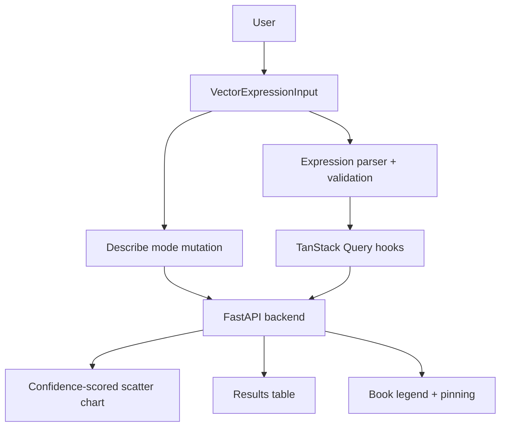

# Embedding Analytics — Frontend

A React/TypeScript application that turns a complex ML backend into a usable research workflow.

Users compose structured vector queries via a chip-based expression builder, translate plain-English questions into editable expressions through an LLM pipeline, and compare results across authors through custom SVG charts with 95% confidence intervals. Results reflect contextual proximity, not dictionary meaning: two terms score highly because the authors discuss them in similar contexts, not because they are synonyms.

**Live demo:** https://www.embedding-analytics.com
**Backend repo:** https://github.com/areebms/embedding-analytics

---

## Engineering highlights

- **Typed expression model:** Custom parser, hooks, and TypeScript types manage structured vector expressions as first-class state, not raw strings
- **Custom SVG data visualization:** Hand-built scatter chart with confidence-interval whiskers and chronological color coding, no charting library
- **LLM-assisted input with human-in-the-loop:** Describe mode translates natural language into editable expression chips so the user always verifies the AI output before relying on it
- **Async data layer:** TanStack Query manages parallel similarity requests across books with query/mutation boundaries, caching, and loading states
- **Responsive layout:** Single-row desktop topbar collapses into a stacked mobile layout without sacrificing functionality
- **Product-facing technical UX:** Plain-language labels paired with technical subtitles (cosine similarity, standard deviation, z-score) make the interface approachable without hiding the analysis

---

## Tech stack

| Area | Tools |
|---|---|
| Framework | React, TypeScript, Vite |
| UI | MUI, custom SVG charts |
| Data fetching | TanStack Query (queries + mutations) |
| State | Custom hooks, typed expression parser |
| Backend | FastAPI on AWS Lambda (separate repo) |

---

## Core features

### Vector expression input

A chip-based autocomplete wired to the backend vocabulary. Terms, operators (`+`, `-`), and parentheses are composed as discrete tokens. The parser validates structure in real time before any query is sent.

Addition narrows context when a term has multiple meanings. `capital + profit` pulls "capital" toward its economic sense and away from the geographical one. Subtraction creates contrast directions:

```text
labour + (productive - unproductive)
```

### Describe mode

A plain-English input that translates to a vector expression through the backend LLM pipeline. The interpreted expression is shown as editable chips so the user can verify or adjust before relying on the result. If a term is not in the corpus, the closest match is substituted and flagged via a warning alert.

The user never stays in describe mode after submitting. It is a translation step, not a conversation.

### Confidence-scored scatter chart

Custom SVG chart where each row is a term, each dot is a book's similarity score, and horizontal whiskers show 95% confidence intervals from the backend model ensemble. Books are color-coded chronologically (warm to cool). The chart makes uncertainty visible rather than hiding it behind a single number.

### Results table

Sortable metrics with plain-language labels and technical subtitles:

- **Consensus** (mean similarity): average score across selected books
- **Divergence** (standard deviation): how much books disagree
- **Relative emphasis** (z-score): visible when a single book is pinned, showing where that author's usage departs from the group

### Book legend and pinning

Toggle books on/off or pin a single author to re-rank by that book's relative emphasis. Color assignments derive from publication year, naturally supporting chronological comparison.

### Guide modal

Card-based two-step walkthrough with MobileStepper navigation. Covers reading the chart, building expressions, and using describe mode.

### Responsive topbar

Desktop: legend, expression input, and help button share one row. Mobile: logo and help icon on top, input centered, legend below.

More detail on how users interact with these features: [`docs/guide.md`](docs/guide.md)

---

## Architecture



Product workflow:

1. Build or describe an expression
2. Validate and normalize into typed expression state
3. Request similarity results for each visible book in parallel
4. Render uncertainty-aware chart and table views
5. Refine the query without losing context

---

## Project structure

```text
src/
├── App.jsx
├── main.tsx
├── api/
│   └── queries.js                  # TanStack Query hooks and mutations
├── components/
│   ├── ResultsTable/
│   │   ├── index.jsx
│   │   ├── Header.jsx
│   │   ├── TermRow.jsx
│   │   └── PinnedMetaRows.jsx
│   ├── TermSimilarityChart/
│   │   ├── index.jsx
│   │   ├── ChartLegend.jsx
│   │   └── ChartTooltip.jsx
│   ├── TopBar/
│   │   ├── index.jsx
│   │   ├── VectorExpressionInput.tsx
│   │   ├── Legend.jsx
│   │   └── BookChip.jsx
│   ├── GuideModal.jsx
│   └── InfoTooltip.jsx
├── content/
│   ├── bookDescriptions.js
│   └── labels.ts                   # All UI copy, tooltips, technical subtitles
├── hooks/
│   ├── useSimilarityData.tsx
│   └── useVectorExpression.ts
├── types/
│   └── vectorExpression.ts
└── utils/
    ├── scales.js
    ├── vectorExpressionOptions.ts
    └── vectorExpressionParser.ts
```

---

## Running locally

```bash
npm install
npm run dev    # --> http://localhost:5173
```

Set `VITE_API_URL` to point at the backend API (local or deployed).

---

## What this demonstrates

- Building a product frontend for an AI/ML backend, not just rendering API responses
- Designing custom SVG data visualizations that expose uncertainty and support comparison
- Managing complex async state with TanStack Query across parallel API requests
- Implementing a typed expression model with parsing, validation, and structured state
- Creating an LLM-assisted input flow with human-in-the-loop verification
- Shipping responsive, mobile-adapted UI over a technically dense domain
- Centralizing all user-facing copy and tooltip content for maintainability

---

## License

Apache-2.0

---

**Areeb Siddiqi** -- [LinkedIn](https://www.linkedin.com/in/areeb-siddiqi/) · [GitHub](https://github.com/areebms)
